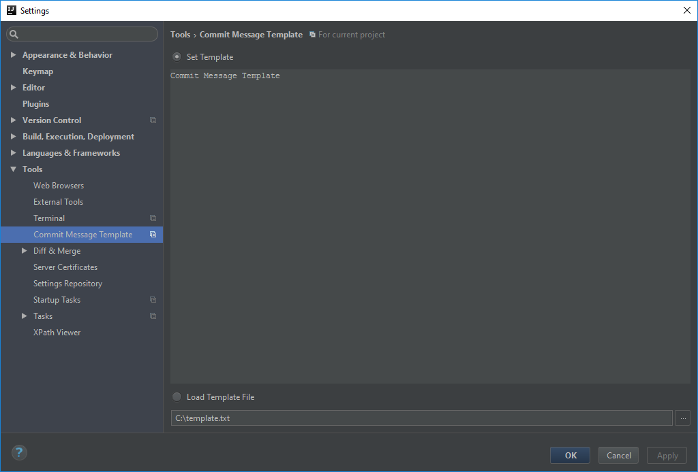
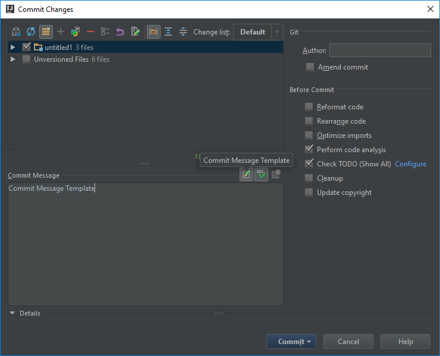

# Commit message template Plugin for Intellij
- Enables setting a pre determined template to be used as the commit message
- Supports Intellij 2016 and up.
- Tested on RubyMine, PHPStorm and IDEA community Edition

## Installation
- Download the [plugin](https://plugins.jetbrains.com/idea/plugin/9364-commit-message-template) and Install from the plugin manager in the IDE (File > Settings > Plugins > Install plugin from disk)

 Or

- Install directly from the IDE plugin manager (File > Settings > Plugins > Browser repositories > Commit Message Template)

## Usage

### Set a template
Open Settings > Tools > Commit Message Template.
Enter the desired template or set the path to a template file

### Use the template
In the Commit Changes Dialog, click the commit message template button

### Credits
Inspired by and built upon the [what-the-commit plugin](https://github.com/darekkay/what-the-commit)